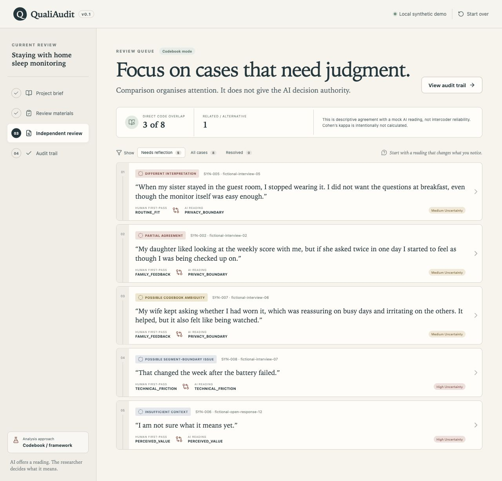

# QualiAudit

> A method-aware, tool-agnostic review layer for qualitative coding.

QualiAudit helps qualitative researchers independently review coded excerpts, examine human–AI disagreements without treating AI as ground truth, and document what changed, why, and how AI influenced the analysis.

It is closer to a pull request for qualitative analysis than an automated coding product: a researcher commits a first-pass interpretation, a reviewer produces a blind independent reading, and the researcher resolves or intentionally preserves the differences.

## Live demo

[Open the QualiAudit synthetic demo](https://qualiaudit-beta.vercel.app)

The demo uses fictional data and defaults to a reviewer that runs entirely in the browser, without an account or API key. An optional real-model adapter is unavailable unless a maintainer deliberately configures it server-side.



## Current release

QualiAudit v0.2.1 is a compatibility and research-readiness patch for the v0.2 workflow. It improves VoiceOver/Safari progression and status announcements, makes long and mixed-language identifiers reflow safely, records manual Safari accessibility evidence, and adds an ethics-gated formative evaluation kit. Read the [v0.2.1 release notes](docs/RELEASE_NOTES_0.2.1.md) and the underlying [v0.2.0 feature notes](docs/RELEASE_NOTES_0.2.0.md).

This remains a research prototype. The release does not claim suitability for sensitive research data, institutional approval, model validity, intercoder reliability, or WCAG conformance.

## Why this project exists

Researchers already doing qualitative coding in Excel, NVivo, MAXQDA, or ATLAS.ti may want a structured way to question code application, examine conceptual overlap, or disclose the influence of AI. Most AI coding interfaces optimise throughput or present model output as an answer. QualiAudit instead optimises for interpretive visibility:

- the human interpretation exists first;
- the AI reviewer cannot see human codes or rationales;
- disagreement is organised for human attention, not converted into an accuracy claim;
- the human keeps final interpretive authority;
- post-exposure changes and rationales remain auditable.

The initial audience is qualitative researchers and doctoral researchers working with interviews or open-ended text who understand their method but may not program.

## Current vertical slice

The browser-only demo supports a complete synthetic workflow while keeping imported material and saved state on the researcher’s device.

1. Open a clearly labelled fictional home sleep-monitoring project.
2. Inspect or locally import a CSV, TSV, or Excel codebook and human first-pass coding.
3. Validate required fields, duplicate codes, missing definitions, and missing inclusion/exclusion guidance.
4. Freeze a time-stamped snapshot of the human interpretation.
5. Choose the no-transmission local reviewer, or review an explicit provider disclosure and consent to an optional server-side reviewer.
6. Prioritise divergence, ambiguity, missing context, segment boundaries, and confidence cases; optionally switch to safe triage groups that keep every unresolved case visible.
7. Record one of nine human resolution decisions with a required rationale.
8. If an optional second-human record exists, inspect its overlap or alternative reading in a separate pre-AI comparison that does not affect the AI queue category.
9. Add append-only researcher reflexive memos linked to a recorded decision without sending them back to the reviewer.
10. When revising the codebook, record an append-only before/after change event, its author, affected excerpts, and unresolved recoding work without rewriting the frozen snapshot.
11. Inspect the separate second-human comparison, decision log, reflexive memo log, codebook-change ledger, and reviewer provenance.
12. Export a reviewed coding table as CSV, a machine-readable audit bundle as JSON, or a self-contained printable HTML report.
13. Save a versioned QualiAudit project file and restore the same review in another browser session.
14. Inspect the locally retained record and explicitly delete it from the browser.

Working state is saved in browser `localStorage`. **Data & privacy** shows the saved project, stage, record counts, and approximate size; deletion removes QualiAudit’s own browser record after confirmation without clearing unrelated site data. A resumable `.qualiaudit.json` project file can be downloaded explicitly; it contains the full review state, including human judgments, decision history, and codebook-change history. The sample’s default path uses no account, API key, backend review call, or third-party model.

## Method-aware behaviour

QualiAudit supports two framings in the project brief.

### Codebook / Framework Analysis

The queue can show descriptive code overlap, related readings, codebook ambiguity, and consistency-relevant information. It explicitly distinguishes comparison with an AI reading from intercoder reliability and does not calculate Cohen’s kappa for the mock AI review. Optional second-human records are summarised separately as direct overlap or different human interpretations; the prototype does not infer a reliability coefficient from that incomplete subset.

### Reflexive Thematic Analysis

The interface switches to language such as *interpretive overlap*, *related readings*, and *alternative reading*. It avoids accuracy and correct/incorrect claims, omits kappa, and presents divergence as material for reflexivity and potentially productive disagreement. A second human’s divergent code is likewise described as an *alternative human reading*, never as an error.

Changing the method in **Project brief** updates the queue framing, comparison labels, audit statement, and methodological notes.

## Safe queue triage

The optional **Triage groups** view organises the complete reviewed set into protected attention, interpretive divergence, routine overlap, and recorded decisions. Missing-context, low-confidence, segment-boundary, codebook-ambiguity, and unsupported-AI cases are pinned first. Every unresolved case remains visible, including direct-overlap cases.

Triage is deliberately non-decisional: it cannot batch-accept AI suggestions, batch-resolve cases, or automatically recode material. The JSON and HTML audit exports state this policy so the safeguard remains inspectable outside the interface.

## The blind-review boundary

`buildBlindReviewPayload()` is the only path from the frozen project record to the reviewer. It allows:

- research question;
- analysis mode and intended AI role;
- codebook definitions;
- excerpt ID, source ID, text, and necessary context.

It excludes:

- `human_code` and `human_rationale`;
- human confidence;
- all second-coder fields;
- later resolutions, final conclusions, and researcher-authored reflexive memos.

An automated test asserts that these human interpretation fields are absent from the serialised browser payload. The optional server endpoint then rebuilds that payload from a second allowlist before any provider request. Extra properties are discarded, and provider output must pass excerpt-ID, codebook, evidence-quote, and schema checks before it is saved. The exported audit bundle records the reviewer, model, named prompt/schema protocol, destination, consent, and safe client/provider request identifiers.

## Run locally

Requirements: Node.js 20 or newer and npm 10 or newer.

```bash
git clone <your-fork-or-repository-url>
cd qualiaudit
npm ci
cp .env.example .env.local
npm run dev
```

Open the local URL printed by Vite, normally `http://localhost:5173`.

No environment variable is needed for the deterministic reviewer. To test the optional provider endpoint, set the empty server-only placeholders in `.env` and use Vercel’s local development environment; Vite alone does not run `api/review.ts`.

The provider key must be named `OPENAI_API_KEY`, never `VITE_OPENAI_API_KEY`. `OPENAI_MODEL` and `QUALIAUDIT_ENABLE_REMOTE_REVIEW=true` are also required explicitly, so a stray key cannot activate transmission and audit provenance does not rely on a silent model default. An optional `QUALIAUDIT_REVIEW_TIMEOUT_MS` is clamped to 10–120 seconds; a timeout or provider rate limit never triggers an automatic resend. See [Optional real reviewer](docs/REMOTE_REVIEWER.md).

## Quality checks

```bash
npm run lint
npm run typecheck
npm run test
npm run build
npm run check:release

# or all checks in sequence
npm run check
```

The test suite covers validation, comma/semicolon/tab-delimited parsing, Unicode and structural import failures, multi-code and segment-boundary diagnostics, blind payload construction, deterministic review structure, explicit provider consent, server-side payload re-allowlisting, strict provider-output checks, method-aware queue labels, comparison categories, safe triage coverage, analytically separate second-human records, spreadsheet and research-tool profile mapping, fictional workbook fixtures, versioned project-file recovery and migration, append-only reflexive memos and codebook-change events, explicit browser-record deletion, CSV/JSON audit data, escaped privacy-minimised HTML reports, representative `axe-core` checks, keyboard interaction patterns, modal focus containment, and progress semantics.

The [accessibility engineering audit](docs/ACCESSIBILITY_AUDIT.md) records what has been checked and what remains. The project does not claim formal WCAG conformance while the VoiceOver, NVDA, zoom, and cross-browser assistive-technology matrix is still pending.

## Data and templates

The bundled files under [`public/samples`](public/samples) are fictional and contain no real participant data:

- [`synthetic-codebook.csv`](public/samples/synthetic-codebook.csv)
- [`synthetic-coded-excerpts.csv`](public/samples/synthetic-coded-excerpts.csv)
- [`synthetic-qualiaudit-import.xlsx`](public/samples/synthetic-qualiaudit-import.xlsx)
- blank-shape codebook and coded-excerpt templates

CSV, TSV, and Excel (`.xlsx`) upload are implemented for codebooks and human-coded excerpts. Delimited-text import detects comma, semicolon, or tab structure, preserves quoted multiline and Unicode content, strips a UTF-8 byte-order mark, and rejects duplicated headers, unclosed quotes, or inconsistent row widths before replacing the current record. Excel import includes worksheet selection, header-row detection, explicit column mapping, and a source preview before replacement. Parsing happens in the browser and the demo supports up to 10 MB or 5,000 data rows per text file or selected sheet.

For selected English-language tabular layouts, QualiAudit can suggest mappings for an NVivo codebook or coding report, MAXQDA retrieved segments, and an ATLAS.ti quotation report. Suggestions come from visible column labels and must be confirmed by the researcher; missing required fields still block import. See [Research-tool import profiles](docs/IMPORT_PROFILES.md) for recognised signals, official documentation, and compatibility limits.

Validation does not silently flatten multiple human codes into one. A primary code cell containing multiple known codebook values becomes a blocking issue, and overlapping excerpts from the same source produce a non-blocking segment-boundary warning. The fictional regression corpus under [`test-fixtures/import`](test-fixtures/import) makes these assumptions inspectable.

These profiles do not parse native project files, guarantee compatibility with every vendor version or locale, infer codes from sheet names, or silently flatten multi-code cells.

The **Save project** action creates a resumable, versioned QualiAudit JSON file. The current project-file schema is version 3; version 1 and 2 files are migrated on restore with empty records for features they predate. This is different from **Export audit JSON**, which is a reporting record and cannot be reopened as a working project. Restoring a project first shows its name, method, stage, material counts, reflexive-memo and codebook-change counts, and export date before replacing browser state.

Choosing **Revise codebook** creates a new ledger event rather than editing the frozen codebook. The event preserves the frozen guidance beside the proposed guidance, records its author and rationale, identifies affected excerpts, and keeps those excerpts visible as unresolved recoding work. Later edits create additional events so prior reasoning remains inspectable.

After recording a case decision, the researcher can add one or more append-only reflexive memos. Each memo preserves its author, timestamp, linked excerpt, and the decision snapshot it followed. Memos remain on the human side of the review boundary and appear in project files and JSON/HTML audit exports, but not in the independent reviewer payload.

Optional second-human codes and rationales are frozen with the first-pass record but withheld from the AI reviewer. The queue shows only a separate descriptive summary; the case view and audit keep the human–human record in its own section. These counts do not alter human–AI categories, claim correctness, or silently become an intercoder-reliability statistic. CSV, JSON audit schema v0.5, and HTML report v0.3 exports preserve this analytical boundary.

The **Data & privacy** action makes automatic browser retention visible and offers a confirmed **Delete local review** control. Browser deletion does not delete `.qualiaudit.json`, CSV, JSON, or other files already downloaded to the device.

The **HTML report** is generated entirely in the browser as one portable file with no scripts, external assets, or network requests. It includes project context, the draft method statement, reviewer provenance, the frozen codebook, decision and reflexive-memo history, unresolved work, and limitations. Its privacy-minimised default omits source excerpts, context, and AI evidence quotes; researchers must make an explicit choice to include them. Coding, decision rationales, and memos can still contain sensitive information. Open the downloaded file in a browser and use **Print** / **Save as PDF** for a PDF copy; QualiAudit does not yet create a native PDF file.

## Technology choices

- **React + TypeScript** keep the stateful review flow explicit and typed while remaining familiar to open-source contributors.
- **Vite** provides a fast, small, reproducible frontend build; a narrowly scoped Vercel serverless function contains the optional provider boundary.
- **Plain CSS** keeps the visual system inspectable and avoids locking an early research product into a component framework.
- **Vitest + Testing Library** support fast unit and interaction-oriented testing in the same TypeScript toolchain.
- **read-excel-file** provides a narrowly scoped, browser-compatible `.xlsx` parser without introducing a server or exposing imported files to a third party.
- **Local-first browser state and versioned project files** make the no-login workflow inspectable and portable without a cloud database. Neither is presented as encrypted storage for sensitive studies.

The dependency lockfile is committed; use `npm ci` for reproducible installation.

## What QualiAudit is not

The current prototype does not:

- generate final themes or perform full-text autonomous analysis;
- replace a second human coder or validate that research findings are correct;
- parse native NVivo, MAXQDA, or ATLAS.ti project files;
- transcribe audio or video;
- provide multi-user collaboration, accounts, payments, or a research-data cloud;
- silently send the public synthetic demo to a model provider.

## Important limitations

- The deterministic reviewer uses transparent keyword-oriented rules. Its readings demonstrate the review workflow, not model quality.
- Browser `localStorage` is not suitable for sensitive or regulated research data. Use only fictional or appropriately governed material in the current prototype.
- The optional provider adapter has an initial secret, consent, allowlist, validation, size, timeout, and safe-error boundary; these controls do not make transmitted data institutionally approved or suitable for sensitive research.
- The initial engineering threat model is public, but QualiAudit still has no accounts, durable application-level rate limiting, institution-specific approval, or claim of suitability for sensitive research data.
- Browser deletion removes QualiAudit’s saved working record, not downloaded files, browser backups, or copies made elsewhere.
- QualiAudit project files are plain JSON backups, not encrypted containers. They may include excerpts, context, human codes, second-coder judgments, rationales, AI reviews, decisions, reflexive memos, codebook-change authors, proposed guidance, and affected-excerpt lists; protect them like the underlying research dataset.
- HTML reports are plain, shareable files rather than encrypted containers. The privacy-minimised option removes source excerpts, context, and AI evidence quotes, but codes, rationales, decisions, reflexive memos, and project metadata may still identify people or studies.
- Delimited-text detection covers comma, semicolon, and tab files, not every locale-specific or proprietary export dialect. Text and Excel imports are limited to 10 MB and 5,000 data rows; formulas are imported as their stored values and encrypted workbooks are unsupported.
- The current first-pass schema accepts one primary human code per excerpt. Multi-code cells are reported for human correction rather than silently flattened.
- Human decisions after AI exposure may be influenced by automation bias even when the review is blind. QualiAudit records changes; it cannot remove that influence.
- Descriptive human–AI overlap is not intercoder reliability, methodological validation, or evidence of correctness.
- Optional second-human records may cover only a non-random subset of excerpts. QualiAudit reports their same/different-code counts descriptively and does not infer intercoder reliability from them.
- The draft methods statement must be adapted to the actual method, model, provider, governance, and institutional requirements.

## Project documents

- [Roadmap](ROADMAP.md)
- [Changelog](CHANGELOG.md)
- [Contributing](CONTRIBUTING.md)
- [Security and research-data guidance](SECURITY.md)
- [Architecture note](docs/ARCHITECTURE.md)
- [Research-tool import profiles](docs/IMPORT_PROFILES.md)
- [Optional real reviewer: security and consent boundary](docs/REMOTE_REVIEWER.md)
- [Initial threat model and deployment gate](docs/THREAT_MODEL.md)
- [Browser encryption feasibility](docs/ENCRYPTION_FEASIBILITY.md)
- [Accessibility engineering audit](docs/ACCESSIBILITY_AUDIT.md)
- [Formative evaluation kit](docs/research/README.md)
- [Issue-ready backlog](docs/ISSUE_BACKLOG.md)
- [Release privacy and secret checklist](docs/RELEASE_CHECKLIST.md)
- [v0.2.1 release notes](docs/RELEASE_NOTES_0.2.1.md)
- [v0.2.0 feature release notes](docs/RELEASE_NOTES_0.2.0.md)

## Contributing

Methodological critique, usability feedback, accessibility improvements, research-tool export examples, and carefully scoped code contributions are welcome. Please start with [CONTRIBUTING.md](CONTRIBUTING.md) and use the issue templates so product and methodological impact stay visible alongside implementation details.

## License

MIT © QualiAudit contributors. See [LICENSE](LICENSE).
